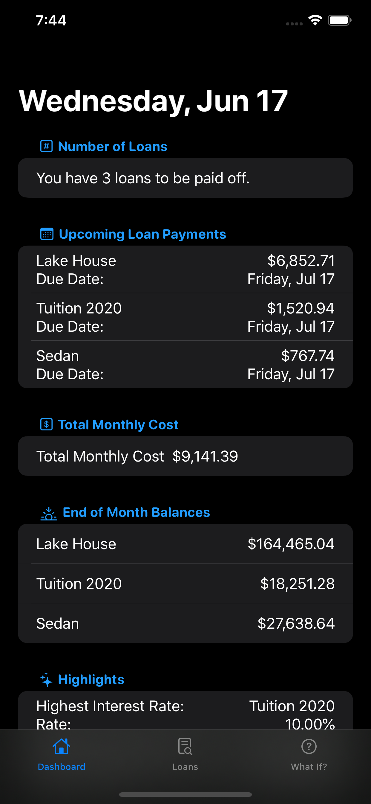

# Loan-Record

Loan Record is an easy way to keep track of all your loans and their due dates. Keep track of your payments and estimate your future loan payments seamlessly.

• Take a quick glance at the loan's highlights to see important information like the due date or the monthly payment. 

• Use the graph to examine in detail what your future balances, principal and interest payments will be. 

• Get your amortization payment schedule in an easy to read table format.

• Stay informed of upcoming payments using the color coded loan overview.

• Use the What If calculators to answer hypothetical questions like, "when am I going to finish paying off this credit card or what's would be my monthly payment for a loan with these terms".

Dark mode support. 

## iPhone 

**Dark Mode** | **Light Mode**
:-------------------------:|:-------------------------:

     | 
:-------------------------:|:-------------------------:
 |  
:-------------------------:|:-------------------------:
 | 
:-------------------------:|:-------------------------:
 | 
:-------------------------:|:-------------------------:
 | 

## iPad 

**Dark Mode** | **Light Mode**
:-------------------------:|:-------------------------:
%20(4th%20generation)%20-%202020-06-17%20at%2019.36.10.png)     | %20(4th%20generation)%20-%202020-06-17%20at%2019.37.05.png)
:-------------------------:|:-------------------------:
%20(4th%20generation)%20-%202020-06-17%20at%2019.36.24.png) |  %20(4th%20generation)%20-%202020-06-17%20at%2019.37.09.png)
:-------------------------:|:-------------------------:
%20(4th%20generation)%20-%202020-06-17%20at%2019.36.27.png) | %20(4th%20generation)%20-%202020-06-17%20at%2019.37.13.png)
:-------------------------:|:-------------------------:
%20(4th%20generation)%20-%202020-06-17%20at%2019.36.50.png) | %20(4th%20generation)%20-%202020-06-17%20at%2019.37.55.png)
:-------------------------:|:-------------------------:
%20(4th%20generation)%20-%202020-06-24%20at%2023.02.05.png)| %20(4th%20generation)%20-%202020-06-24%20at%2023.01.54.png)

### Version 1.0

